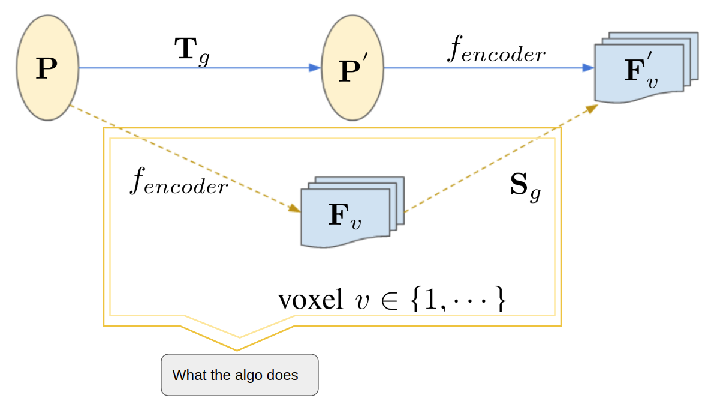
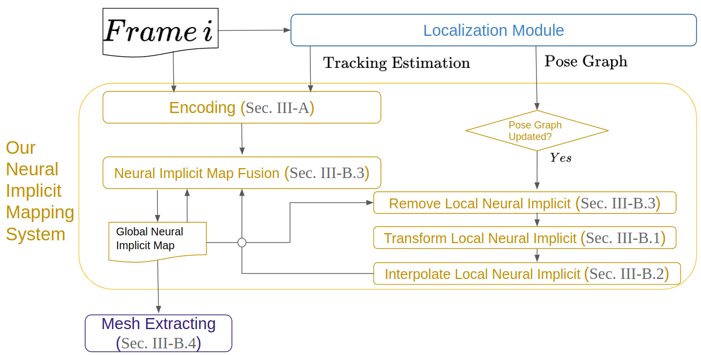

# [SE(3)-Transformation on Neural Implicit Maps for Remapping Functions](https://jarrome.github.io/IMT-MAP/)

This repository contains the implementation of our **RAL 2022** paper: **An Algorithm for the SE(3)-Transformation on Neural Implicit Maps for Remapping Functions**.

[Yijun Yuan](https://jarrome.github.io/), [Andreas Nüchter](https://www.informatik.uni-wuerzburg.de/space/mitarbeiter/nuechter/)

[Preprint](https://arxiv.org/abs/2206.08712) |  [website](https://jarrome.github.io/IMT-MAP/)
<!--- 
* What the algorithm does



Two flow paths to SE(3)-transform and deep encode
the point cloud. The **solid line** indicates the **transform-
encoding path** to generate implicit map of $\mathbf T_g$ -transformed
point cloud P. The **dash line** shows the **encoding-transform
path**, transforming the map of features with transformation
$\mathbf S_g$ , that is introduced in this paper.


* Application with proposed **remapping module** that **allows for loop clusure**


-->
***Brief intro of this project shows in [website](https://jarrome.github.io/IMT-MAP/).***

## 0. Install
```
conda create -n recons python=3.6
conda activate recons

conda install pytorch=1.6.0 torchvision=0.7.0  cudatoolkit=10.1 -c pytorch
pip install torch-scatter==1.4 open3d numba opencv-python
```
*Be sure you have build-essential before torch-scatter (sudo apt install build-essential). If you still have problem on torch-scatter, please directly copy that torch-scatter function into the script.*

## 1. Quick Reconstruction Demo

We have pretrained parameter of encoder-decoder in ```./treasure``` for easy use.

**Prepare data**

* Download [ICL-NUIM](https://www.doc.ic.ac.uk/~ahanda/VaFRIC/iclnuim.html) data (TUM RGB-D Compatible PNGs with noise). 
```mkdir ./data``` and unzip inside, for example, you will have ```./data/ICL_NUIM/lr_kt0n``` 

*(Replaca dataset requires contacting [iMAP](https://edgarsucar.github.io/iMAP/) author, and put into ./data as described in ./config/ifr-fusion-replica.yaml)*

* For quick play, please download our [pose stream](https://drive.google.com/drive/folders/1NLp7eGjmjr5zK8QnRqlyghKEH-sn_0mj?usp=sharing) computed from ORB-SLAM2.
```mkdir ./treasure/orbslam2_record``` and unzip inside, for example, you will have ```./treasure/orbslam2_record/lrkt0n```.

1.  **Reconstruction Demo** (will draw a window with incremental reconstruction and output the intermediary mesh in args.outdir. )
```
python pose_fmt.py ./configs/ifr-fusion-lr-kt0.yaml
``` 

2. **Transformation Demo** (will save a. transform-then-encode [tgt.ply] and b. encode-then-transform [tsrc.ply] to args.outdir+'transform') 
```
python exp_transform.py ./configs/ifr-fusion-lr-kt0.yaml
``` 

Please find more detail in configs/[config_file.yaml].

*NOTE: the first run may takes some time to compile functions of system/ext from DI-Fusion*

The experiment is on one GTX2080Ti, but I find it can also run well (take around 3GB) on my laptop (Legion R9000X) with a 1650Ti.

## 2. How to configure (help make your own config)
Reconstruction goes with ```python pose_fmt.py [config_file.yaml] ``` where we provide some [config_file] in ```./config```

In addition, we provide a guidline on *what does it mean* in [config readme](./configs/).

---

## (Optional) Training the VNN-Encoder and Decoder
As we have provided the pretained model, this step is not necessary, as the model is a transfering from synthetic to real scenario.

But for friends are interested, we provid as follow:
1. follow [DI-Fusion](https://github.com/huangjh-pub/di-fusion) to prepare the ShapeNet data for training.

2. ```python network_trainer.py configs/train.yaml``` to train. 

*NOTE: put the ShapeNet data on SSD because read on HDD during training is extremely slow...*

This training step is actually the same as DI-Fusion, we replace encoder with SO3 equivariant layer from vnn.

---

## (Optional) What's more
We further rewrite and extend the test scope to a campus-scale dataset KITTI-odometry following reviewer's suggestion. 
LiDAR-SLAM on  KITTI-odometry in community focus more on trajectory. 
But here we use it to provide a large-scale demo.

**Prepare data**

Download our [pose stream](https://drive.google.com/drive/folders/1NLp7eGjmjr5zK8QnRqlyghKEH-sn_0mj?usp=sharing) computed from PyICP-SLAM.
```mkdir ./treasure/pyicp_slam_record``` and unzip inside, for example, you will have ```./treasure/pyicp_slam_record/kitti00```. 
Because PyICP-SLAM produces pose stream stored in .csv file but not .txt as we used in indoor data. The zip might be large.

Download [kitti-odometry data](http://www.cvlibs.net/datasets/kitti/eval_odometry.php) and then have folder like ``./data/kitti_odometry/dataset/sequences''

**Demo** 
```
python pose_fmt_kitti.py ./configs/test_kitti.yaml
``` 

## What's Next?
1. A full reconstruction release.


## Citation
If you find this work interesting, please cite us:
```bibtex
@article{yuan2022transform,
  title={An Algorithm for the SE(3)-Transformation on Neural Implicit Maps for Remapping Functions},
  author={Yuan, Yijun and N{\"u}chter, Andreas},
  journal={IEEE Robotics and Automation Letters},
  year={2022},
  publisher={IEEE}
}
```


## Acknowlegement
* This project is on top of [DI-Fusion](https://github.com/huangjh-pub/di-fusion), we thank Jiahui Huang for his warm responses and helps on DI-Fusion.
* The encoder part is implemented with [vnn](https://github.com/FlyingGiraffe/vnn).
* The replaca dataset is provided from [iMAP](https://arxiv.org/abs/2103.12352) author Edgar Sucar. We thank the warm help on that dataset from Zihan Zhu.
